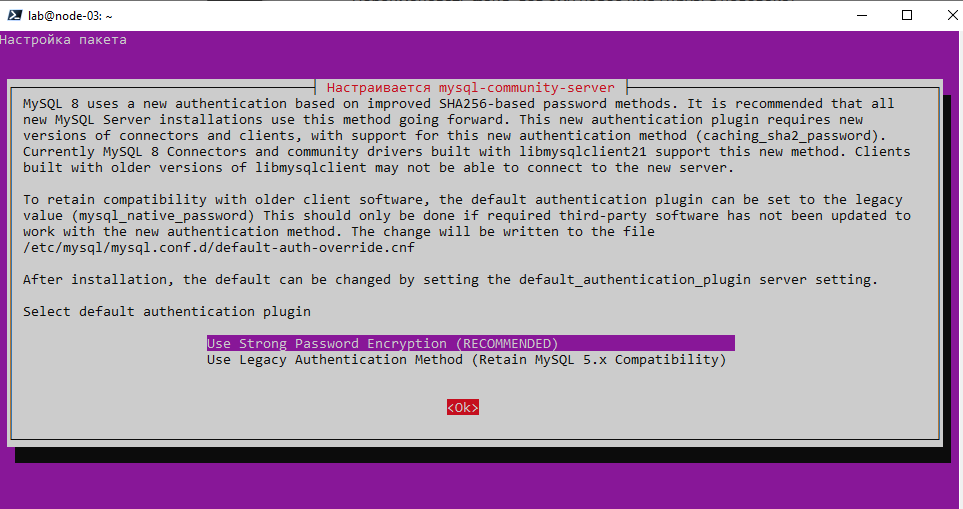
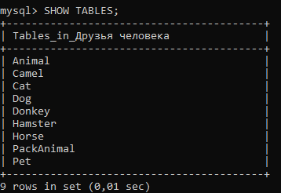

## Решение
1. Используя команду __cat__ в терминале операционной системы __Linux__, создать два файла Домашние животные (заполнив файл собаками, кошками, хомяками) и Вьючные животными (заполнив файл Лошадьми, верблюдами и
ослы), а затем объединить их. Просмотреть содержимое созданного файла.
Переименовать файл, дав ему новое имя (Друзья человека).
~~~
lab@node-03:~$ mkdir FinalExaminationSpecialization
lab@node-03:~$ cd FinalExaminationSpecialization/
lab@node-03:~/FinalExaminationSpecialization$ cat > "Домашние животные" << EOF
> собаки
> кошки
> хомяки
> EOF
lab@node-03:~/FinalExaminationSpecialization$ cat > "Вьючные животными" << EOF
> Лошадьми
> верблюдами
> ослы
> EOF
lab@node-03:~/FinalExaminationSpecialization$ cat "Домашние животные" "Вьючные животными" > "Друзья человека"
lab@node-03:~/FinalExaminationSpecialization$ cat "Друзья человека"
собаки
кошки
хомяки
Лошадьми
верблюдами
ослы
lab@node-03:~/FinalExaminationSpecialization$ mv "Друзья человека" "Новое имя файла"
~~~
2. Создать директорию, переместить файл туда. 
~~~
lab@node-03:~/FinalExaminationSpecialization$ mkdir new_dir
lab@node-03:~/FinalExaminationSpecialization$ mv "Новое имя файла" "Друзья человека"
lab@node-03:~/FinalExaminationSpecialization$ ls
 new_dir  'Вьючные животными'  'Домашние животные'  'Друзья человека'
lab@node-03:~/FinalExaminationSpecialization$ mv "Друзья человека" new_dir/
~~~
3. Подключить дополнительный репозиторий __MySQL__. Установить любой пакет из этого репозитория.

- Обновляю информацию о пакетах: __sudo apt update__
- Добавляю репозиторий MySQL: __sudo add-apt-repository "deb http://repo.mysql.com/apt/ubuntu/ bionic mysql-apt-config"__
~~~
lab@node-03:~/FinalExaminationSpecialization$ sudo apt update
lab@node-03:~/FinalExaminationSpecialization$ sudo apt upgrade

lab@node-03:~/FinalExaminationSpecialization$ sudo add-apt-repository "deb http://repo.mysql.com/apt/ubuntu/ jammy mysql-apt-config"
Репозиторий: 'deb http://repo.mysql.com/apt/ubuntu/ jammy mysql-apt-config'
Описание:
Archive for codename: jammy components: mysql-apt-config
Дополнительные сведения: http://repo.mysql.com/apt/ubuntu/
Добавление репозитория.
Нажмите [ENTER] для продолжения или Ctrl-C для отмены.
Adding deb entry to /etc/apt/sources.list.d/archive_uri-http_repo_mysql_com_apt_ubuntu_-jammy.list
Adding disabled deb-src entry to /etc/apt/sources.list.d/archive_uri-http_repo_mysql_com_apt_ubuntu_-jammy.list
Сущ:1 http://ru.archive.ubuntu.com/ubuntu jammy InRelease
Сущ:2 http://ru.archive.ubuntu.com/ubuntu jammy-updates InRelease
Пол:3 http://repo.mysql.com/apt/ubuntu jammy InRelease [15,2 kB]
Сущ:4 http://ru.archive.ubuntu.com/ubuntu jammy-backports InRelease
Сущ:5 http://security.ubuntu.com/ubuntu jammy-security InRelease
Сущ:6 https://download.docker.com/linux/ubuntu jammy InRelease
Ошб:3 http://repo.mysql.com/apt/ubuntu jammy InRelease
  Следующие подписи не могут быть проверены, так как недоступен открытый ключ: NO_PUBKEY 467B942D3A79BD29
Чтение списков пакетов… Готово
W: Ошибка GPG: http://repo.mysql.com/apt/ubuntu jammy InRelease: Следующие подписи не могут быть проверены, так как недоступен открытый ключ: NO_PUBKEY 467B942D3A79BD29
E: Репозиторий «http://repo.mysql.com/apt/ubuntu jammy InRelease» не подписан.
N: Обновление из этого репозитория нельзя выполнить безопасным способом, поэтому по умолчанию он отключён.
N: Информацию о создании репозитория и настройках пользователя смотрите в справочной странице apt-secure(8).
lab@node-03:~/FinalExaminationSpecialization$ sudo service mysql status
Unit mysql.service could not be found.
lab@node-03:~/FinalExaminationSpecialization$ sudo apt install mysql-server
Чтение списков пакетов… Готово
Построение дерева зависимостей… Готово
Чтение информации о состоянии… Готово
Будут установлены следующие дополнительные пакеты:
  libaio1 libcgi-fast-perl libcgi-pm-perl libevent-core-2.1-7 libevent-pthreads-2.1-7 libfcgi-bin libfcgi-perl
  libfcgi0ldbl libhtml-template-perl libmecab2 libprotobuf-lite23 mecab-ipadic mecab-ipadic-utf8 mecab-utils
  mysql-client-8.0 mysql-client-core-8.0 mysql-common mysql-server-8.0 mysql-server-core-8.0
  ...
done!
update-alternatives: используется /var/lib/mecab/dic/ipadic-utf8 для предоставления /var/lib/mecab/dic/debian (mecab-dictionary) в автоматическом режиме
Настраивается пакет mysql-server-8.0 (8.0.33-0ubuntu0.22.04.2) …
update-alternatives: используется /etc/mysql/mysql.cnf для предоставления /etc/mysql/my.cnf (my.cnf) в автоматическом режиме
Renaming removed key_buffer and myisam-recover options (if present)
mysqld will log errors to /var/log/mysql/error.log
mysqld is running as pid 14509
Created symlink /etc/systemd/system/multi-user.target.wants/mysql.service → /lib/systemd/system/mysql.service.
Настраивается пакет mysql-server (8.0.33-0ubuntu0.22.04.2) …
Обрабатываются триггеры для man-db (2.10.2-1) …
Обрабатываются триггеры для libc-bin (2.35-0ubuntu3.1) …
lab@node-03:~/FinalExaminationSpecialization$ sudo service mysql status
● mysql.service - MySQL Community Server
     Loaded: loaded (/lib/systemd/system/mysql.service; enabled; vendor preset: enabled)
     Active: active (running) since Thu 2023-07-13 01:20:50 MSK; 7s ago
    Process: 14692 ExecStartPre=/usr/share/mysql/mysql-systemd-start pre (code=exited, status=0/SUCCESS)
   Main PID: 14700 (mysqld)
     Status: "Server is operational"
      Tasks: 38 (limit: 8445)
     Memory: 365.3M
        CPU: 1.654s
     CGroup: /system.slice/mysql.service
             └─14700 /usr/sbin/mysqld

июл 13 01:20:48 node-03 systemd[1]: Starting MySQL Community Server...
июл 13 01:20:50 node-03 systemd[1]: Started MySQL Community Server.
~~~
- Устанавливаю пакет MySQL из репозитория: __sudo apt install mysql-server__
- Проверяю статус службы:__sudo service mysql status__
  
1. Установить и удалить __deb-пакет__ с помощью __dpkg__.
Скачаем в исходную папку деб-пакет __teamviewer__ с помощью утилиты __wget__, затем установим с помощью утилиты __dpkg__:
~~~
lab@node-03:~/FinalExaminationSpecialization$ wget https://download.teamviewer.com/download/linux/teamviewer_amd64.deb
--2023-07-13 01:59:49--  https://download.teamviewer.com/download/linux/teamviewer_amd64.deb
Распознаётся download.teamviewer.com (download.teamviewer.com)… 104.16.63.16, 104.16.62.16, 2606:4700::6810:3e10, ...
Подключение к download.teamviewer.com (download.teamviewer.com)|104.16.63.16|:443... соединение установлено.
HTTP-запрос отправлен. Ожидание ответа… 302 Found
Кукисы, полученные из download.teamviewer.com, попытались изменить домен на downloadprovider.teamviewer.com
Кукисы, полученные из download.teamviewer.com, попытались изменить домен на downloadprovider.teamviewer.com
Адрес: https://dl.teamviewer.com/download/linux/version_15x/teamviewer_15.43.7_amd64.deb [переход]
--2023-07-13 01:59:49--  https://dl.teamviewer.com/download/linux/version_15x/teamviewer_15.43.7_amd64.deb
Распознаётся dl.teamviewer.com (dl.teamviewer.com)… 104.16.62.16, 104.16.63.16, 2606:4700::6810:3f10, ...
Подключение к dl.teamviewer.com (dl.teamviewer.com)|104.16.62.16|:443... соединение установлено.
HTTP-запрос отправлен. Ожидание ответа… 200 OK
Длина: 86262340 (82M) [application/octet-stream]
Сохранение в: ‘teamviewer_amd64.deb’

teamviewer_amd64.deb          100%[=================================================>]  82,27M  1,15MB/s    за 62s

2023-07-13 02:00:51 (1,34 MB/s) - ‘teamviewer_amd64.deb’ сохранён [86262340/86262340]
~~~
Далее вводим команду для установки всех пакетов из директории:
~~~
sudo dpkg -i *.deb
~~~
Получаем ошибку, так как программа не умеет разрешать зависимости, для решения этой проблемы устанавливаем недостающие зависимости __libminizip1__ и __libxcb-xinerama0__.
Удаляем __deb-пакет__ полностью, включая его файлы конфигурации:
~~~ 
sudo dpkg -P teamviewer
~~~
Проверяем наличие пакетов, содержащих имя __team__:
~~~
dpkg-query -W -f='${Package}\n' | grep 'team'
~~~
5. Выложить историю команд в терминале __ubuntu__
~~~
  101  mkdir FinalExaminationSpecialization
  102  cat > "Домашние животные" << EOF
собаки
кошки
хомяки


  103  cd FinalExaminationSpecialization/
  104  cat > "Домашние животные" << EOF
собаки
кошки
хомяки
EOF

  105  ls
  106  cat > "Вьючные животными" << EOF
Лошадьми
верблюдами
ослы
EOF

  107  lls
  108  ls
  109  cat "Домашние животные" "Вьючные животными" > "Друзья человека"
  110  cat "Друзья человека"
  111  mv "Друзья человека" "Новое имя файла"
  112  cd
  113  rm -r FinalExaminationSpecialization/
  114  ls
  115  clear
  116  mkdir FinalExaminationSpecialization
  117  cd FinalExaminationSpecialization/
  118  cat > "Домашние животные" << EOF
собаки
кошки
хомяки
EOF

  119  cat > "Вьючные животными" << EOF
Лошадьми
верблюдами
ослы
EOF

  120  cat "Домашние животные" "Вьючные животными" > "Друзья человека"
  121  cat "Друзья человека"
  122  mv "Друзья человека" "Новое имя файла"
  123  mkdir new_dir
  124  mv "Новое имя файла" "Друзья человека"
  125  ls
  126  mv "Друзья человека" new_dir/
  127  sudo update
  128  sudo apt update
  129  sudo apt upgrade
  130  sudo add-apt-repository "deb http://repo.mysql.com/apt/ubuntu/ jammy mysql-apt-config"
  131  sudo service mysql status
  132  sudo apt install mysql-server
  133  sudo service mysql status
  134  apt download libssl-dev
  135  sudo dpkg -i libssl-dev_3.0.2-0ubuntu1.10_amd64.deb
  136  wget https://download.teamviewer.com/download/linux/teamviewer_amd64.deb
  137  sudo dpkg -i *.deb
  138  sudo dpkg -i teamviewer_amd64.deb
  139  sudo apt-get install libminizip1 libxcb-xinerama0
  140  sudo apt-get -f install
  141  sudo apt update
  142  sudo apt upgrade
  143  history
  144  sudo dpkg -P teamviewer_amd64.deb
  145  sudo dpkg -P teamviewer
  146  sudo dpkg -P telnet
  147  dpkg-query -W -f='${Package}\n' | grep 'team'
  148  history
~~~
6. Нарисовать диаграмму, в которой есть класс родительский класс, домашние животные и вьючные животные, в составы которых в случае домашних
животных войдут классы: собаки, кошки, хомяки, а в класс вьючные животные войдут: Лошади, верблюды и ослы.

7. В подключенном __MySQL__ репозитории создать базу данных “Друзья человека”
Проверим политику пакетов, включая информацию о репозиториях, установленх в системе: __sudo apt policy__
В случае получения ошибки об отсутсвии открытого ключа, отправляем запрос на сервер ключей Ubuntu для его получения:
__sudo apt-key adv --keyserver keyserver.ubuntu.com --recv-keys 467B942D3A79BD29__
Обновляем список пакетов и добавляем репозиторий:
__sudo add-apt-repository 'deb http://repo.mysql.com/apt/ubuntu jammy mysql-8.0'__
В случае выдачи предупреждения о хранении ключа в старом формате, импортируем его в новый (под суперпользователем):
__sudo gpg --dearmor < /etc/apt/trusted.gpg > /etc/apt/trusted.gpg.d/mysql.gpg__
Удаляем старый ключ: __sudo rm /etc/apt/trusted.gpg__
Проверяем установку дополнительного пакета MySQL:
__sudo apt install mysql-server__
Устанавливаем MySQL:

Устанавливаем пароль root: __mysqladmin password -u root -p__
Удаляем ненужные пакеты: __sudo apt autoremove__
Заходим в MySQL и создаём базу данных:
```
CREATE DATABASE `Друзья человека`;
```
8. Создать таблицы с иерархией из диаграммы в БД
Заходим в базу данных: __USE `Друзья человека`__
Вводим команды:
```
Создание родительской таблицы "Животное":

CREATE TABLE Animal (
    id INT PRIMARY KEY AUTO_INCREMENT,
    name VARCHAR(50)
);
Создание таблицы "Домашние животные" с внешним ключом, наследника таблицы "Животное":

CREATE TABLE Pet (
    id INT PRIMARY KEY AUTO_INCREMENT,
    animal_id INT,
    name VARCHAR(50),
    FOREIGN KEY (animal_id) REFERENCES Animal(id)
);
Создание таблицы "Вьючные животные" с внешним ключом, наследникаука таблицы "Животное":

CREATE TABLE PackAnimal (
    id INT PRIMARY KEY AUTO_INCREMENT,
    animal_id INT,
    name VARCHAR(50),
    FOREIGN KEY (animal_id) REFERENCES Animal(id)
);
Создание таблиц "Собаки", "Кошки", "Хомяки" с внешним ключом, наследников таблицы "Домашние животные":

CREATE TABLE Dog (
    id INT PRIMARY KEY AUTO_INCREMENT,
    pet_id INT,
    name VARCHAR(50),
    command VARCHAR(50),
    birth_date DATE,
    FOREIGN KEY (pet_id) REFERENCES Pet(id)
);

CREATE TABLE Cat (
    id INT PRIMARY KEY AUTO_INCREMENT,
    pet_id INT,
    name VARCHAR(50),
    command VARCHAR(50),
    birth_date DATE,
    FOREIGN KEY (pet_id) REFERENCES Pet(id)
);

CREATE TABLE Hamster (
    id INT PRIMARY KEY AUTO_INCREMENT,
    pet_id INT,
    name VARCHAR(50),
    command VARCHAR(50),
    birth_date DATE,
    FOREIGN KEY (pet_id) REFERENCES Pet(id)
);
Создание таблиц "Лошади", "Верблюды", "Ослы" с внешним ключом, наследников таблицы "Вьючные животные":

CREATE TABLE Horse (
    id INT PRIMARY KEY AUTO_INCREMENT,
    pack_animal_id INT,
    name VARCHAR(50),
    command VARCHAR(50),
    birth_date DATE,
    FOREIGN KEY (pack_animal_id) REFERENCES PackAnimal(id)
);

CREATE TABLE Camel (
    id INT PRIMARY KEY AUTO_INCREMENT,
    pack_animal_id INT,
    name VARCHAR(50),
    command VARCHAR(50),
    birth_date DATE,
    FOREIGN KEY (pack_animal_id) REFERENCES PackAnimal(id)
);

CREATE TABLE Donkey (
    id INT PRIMARY KEY AUTO_INCREMENT,
    pack_animal_id INT,
    name VARCHAR(50),
    command VARCHAR(50),
    birth_date DATE,
    FOREIGN KEY (pack_animal_id) REFERENCES PackAnimal(id)
);
```
Проверяем созданную БД: 
```
mysql> SHOW DATABASES;
mysql> SHOW TABLE;
```


9. Заполнить низкоуровневые таблицы именами(животных), командами которые они выполняют и датами рождения
Прежде, чем заполнять низкоуровнневые таблицы, заполним родительские:
```
Заполнение таблицы "Животное" соответствующими значениями:

INSERT INTO Animal (name, command, birth_date)
VALUES ('Домашние животные', '', '1900-01-01'),
       ('Вьючные животные', '', '1900-01-01');

Заполнение таблицы "Домашние животные" соответствующими значениями:

INSERT INTO Pet (animal_id, name, command, birth_date)
SELECT a.id, a.name, a.command, a.birth_date
FROM Animal a;

Заполнение таблицы "Вьючные животные" соответствующими значениями:

INSERT INTO PackAnimal (animal_id)
SELECT id FROM Animal WHERE name = 'Вьючные животные';
```
Заполним низкоуровнивые таблицы:

Таблица "Собаки":
```
INSERT INTO Dog (pet_id)
SELECT id FROM Pet WHERE animal_id = (
    SELECT id FROM Animal WHERE name = 'Собаки'
);

UPDATE Dog
SET name = CASE
    WHEN id = 1 THEN 'Ева'
    WHEN id = 2 THEN 'Жужа'
    WHEN id = 3 THEN 'Зара'
    WHEN id = 4 THEN 'Ярик'
    WHEN id = 5 THEN 'Арчи'
    WHEN id = 6 THEN 'Буч'
    WHEN id = 7 THEN 'Веня'
    WHEN id = 8 THEN 'Бор'
END,
command = CASE
    WHEN id IN (1, 2) THEN 'Сидеть'
    WHEN id IN (3, 4) THEN 'Ко мне'
    WHEN id = 5 THEN 'Лежать'
    WHEN id = 6 THEN 'Жди'
    WHEN id IN (7, 8) THEN 'Фу'
END,
birth_date = DATE(NOW() - INTERVAL FLOOR(RAND() * 365) DAY)
WHERE id BETWEEN 1 AND 8;
```
Таблица "Кошки":
```
INSERT INTO Cat (pet_id)
SELECT id FROM Pet WHERE animal_id = (
    SELECT id FROM Animal WHERE name = 'Кошки'
);

UPDATE Cat
SET name = CASE
    WHEN id = 1 THEN 'Астра'
    WHEN id = 2 THEN 'Анора'
    WHEN id = 3 THEN 'Ваниль'
    WHEN id = 4 THEN 'Луна'
    WHEN id = 5 THEN 'Фрости'
    WHEN id = 6 THEN 'Симба'
    WHEN id = 7 THEN 'Феникс'
END,
command = CASE
    WHEN id = 1 THEN 'Принеси'
    WHEN id = 2 THEN 'Поцелуй'
    WHEN id = 3 THEN 'Прыжок через обруч'
    WHEN id = 4 THEN 'Стоять на задних лапах'
END,
birth_date = DATE(NOW() - INTERVAL FLOOR(RAND() * 365) DAY)
WHERE id BETWEEN 1 AND 7;
```
Таблица "Хомяки":
```
INSERT INTO Hamster (pet_id)
SELECT id FROM Pet WHERE animal_id = (
    SELECT id FROM Animal WHERE name = 'Хомяки'
);

UPDATE Hamster
SET name = CASE
    WHEN id = 1 THEN 'Рыжик'
    WHEN id = 2 THEN 'Умка'
    WHEN id = 3 THEN 'Черныш'
    WHEN id = 4 THEN 'Зола'
    WHEN id = 5 THEN 'Грэй'
    WHEN id = 6 THEN 'Уайт'
    WHEN id = 7 THEN 'Голд'
    WHEN id = 8 THEN 'Сильвер'
END,
command = CASE
    WHEN id = 1 THEN 'стоять'
    WHEN id = 2 THEN 'прыжок'
    WHEN id = 3 THEN 'круг'
    WHEN id = 4 THEN 'перевернуться'
    WHEN id = 5 THEN 'Перевернуться'
    WHEN id = 6 THEN 'фу'
END,
birth_date = DATE(NOW() - INTERVAL FLOOR(RAND() * 365) DAY)
WHERE id BETWEEN 1 AND 8;
```
Таблица "Лошади":
```
INSERT INTO Horse (pack_animal_id)
SELECT id FROM PackAnimal WHERE animal_id = (
    SELECT id FROM Animal WHERE name = 'Лошади'
);

UPDATE Horse
SET name = CASE
    WHEN id = 1 THEN 'Апполон'
    WHEN id = 2 THEN 'Геопард'
    WHEN id = 3 THEN 'Астон'
    WHEN id = 4 THEN 'Адонис'
    WHEN id = 5 THEN 'Жокер'
    WHEN id = 6 THEN 'Зулан'
    WHEN id = 7 THEN 'Дымка'
END,
command = CASE
    WHEN id = 1 THEN 'Рысь'
    WHEN id = 2 THEN 'Хоп'
    WHEN id = 3 THEN 'Шагом'
    WHEN id = 4 THEN 'Тише'
    WHEN id = 5 THEN 'Стой'
    WHEN id = 6 THEN 'Вперёд'
END,
birth_date = DATE(NOW() - INTERVAL FLOOR(RAND() * 365) DAY)
WHERE id BETWEEN 1 AND 7;
```
Таблица "Верблюды":
```
INSERT INTO Camel (pack_animal_id)
SELECT id FROM PackAnimal WHERE animal_id = (
    SELECT id FROM Animal WHERE name = 'Верблюды'
);

UPDATE Camel
SET name = CASE
    WHEN id = 1 THEN 'Мария'
    WHEN id = 2 THEN 'Ланцелот'
    WHEN id = 3 THEN 'Джаред'
    WHEN id = 4 THEN 'Шоко'
    WHEN id = 5 THEN 'Фуршет'
    WHEN id = 6 THEN 'Каберне'
    WHEN id = 7 THEN 'Оазис'
END,
command = CASE
    WHEN id = 1 THEN 'Вперёд'
    WHEN id = 2 THEN 'Стой'
    WHEN id = 3 THEN 'Право'
    WHEN id = 4 THEN 'Лево'
    WHEN id = 5 THEN 'Тише'
    WHEN id = 6 THEN 'лежать'
END,
birth_date = DATE(NOW() - INTERVAL FLOOR(RAND() * 365) DAY)
WHERE id BETWEEN 1 AND 7;
```
Таблица "Ослы":
```
INSERT INTO Donkey (pack_animal_id)
SELECT id FROM PackAnimal WHERE animal_id = (
    SELECT id FROM Animal WHERE name = 'Ослы'
);

UPDATE Donkey
SET name = CASE
    WHEN id = 1 THEN 'Чили'
    WHEN id = 2 THEN 'Шрек'
    WHEN id = 3 THEN 'Бакару'
    WHEN id = 4 THEN 'Бублик'
    WHEN id = 5 THEN 'Пончо'
    WHEN id = 6 THEN 'Пикачу'
    WHEN id = 7 THEN 'Пончик'
    WHEN id = 8 THEN 'Кикер'
    WHEN id = 9 THEN 'Ячмень'
END,
command = CASE
    WHEN id IN (1, 2, 3, 4) THEN 'Вперёд'
    WHEN id IN (5, 6) THEN 'Стой'
    WHEN id = 7 THEN 'Право'
    WHEN id = 8 THEN 'Лево'
    WHEN id = 9 THEN 'Тише'
END,
birth_date = DATE(NOW() - INTERVAL FLOOR(RAND() * 365) DAY)
WHERE id BETWEEN 1 AND 9;
```

10.  Удалив из таблицы верблюдов, т.к. верблюдов решили перевезти в другой
питомник на зимовку. Объединить таблицы лошади, и ослы в одну таблицу.
11.  Создать новую таблицу “молодые животные” в которую попадут все
животные старше 1 года, но младше 3 лет и в отдельном столбце с точностью
до месяца подсчитать возраст животных в новой таблице
12.  Объединить все таблицы в одну, при этом сохраняя поля, указывающие на
прошлую принадлежность к старым таблицам.
13.  Создать класс с Инкапсуляцией методов и наследованием по диаграмме.
14.  Написать программу, имитирующую работу реестра домашних животных.
В программе должен быть реализован следующий функционал:

    14.1. Завести новое животное;
    14.2. определять животное в правильный класс;
    14.3. увидеть список команд, которое выполняет животное;
    14.4. обучить животное новым командам;
    14.5. Реализовать навигацию по меню.

15.   Создайте класс Счетчик, у которого есть метод __add()__, увеличивающий̆
значение внутренней̆int переменной на 1 при нажатие __“Завести новое животное”__ Сделайте так, чтобы с объектом такого типа можно было работать в
блоке __try-with-resources__. Нужно бросить исключение, если работа с объектом
типа счетчик была не в ресурсном __try__ и/или ресурс остался открыт. Значение
считать в ресурсе __try__, если при заведения животного заполнены все поля.